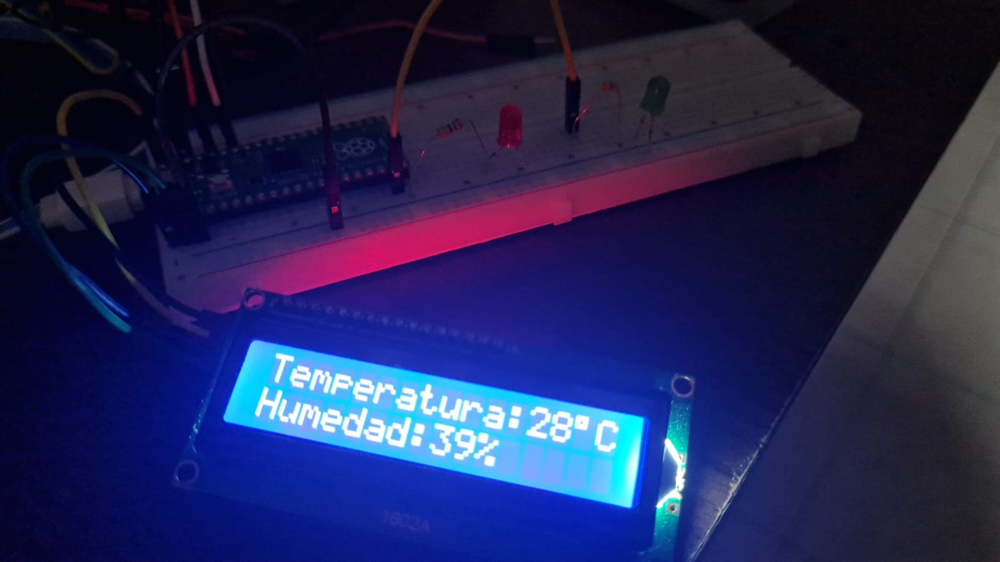
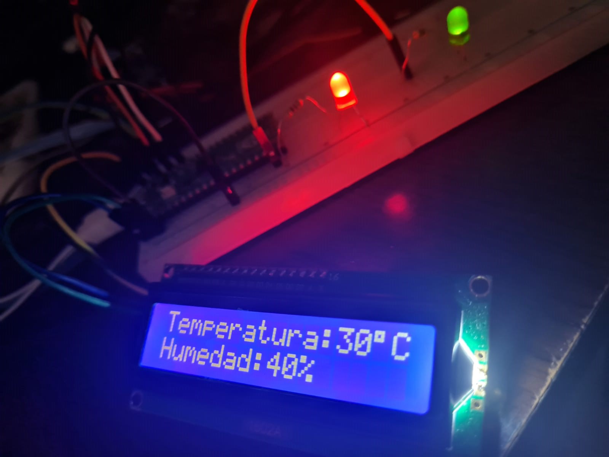
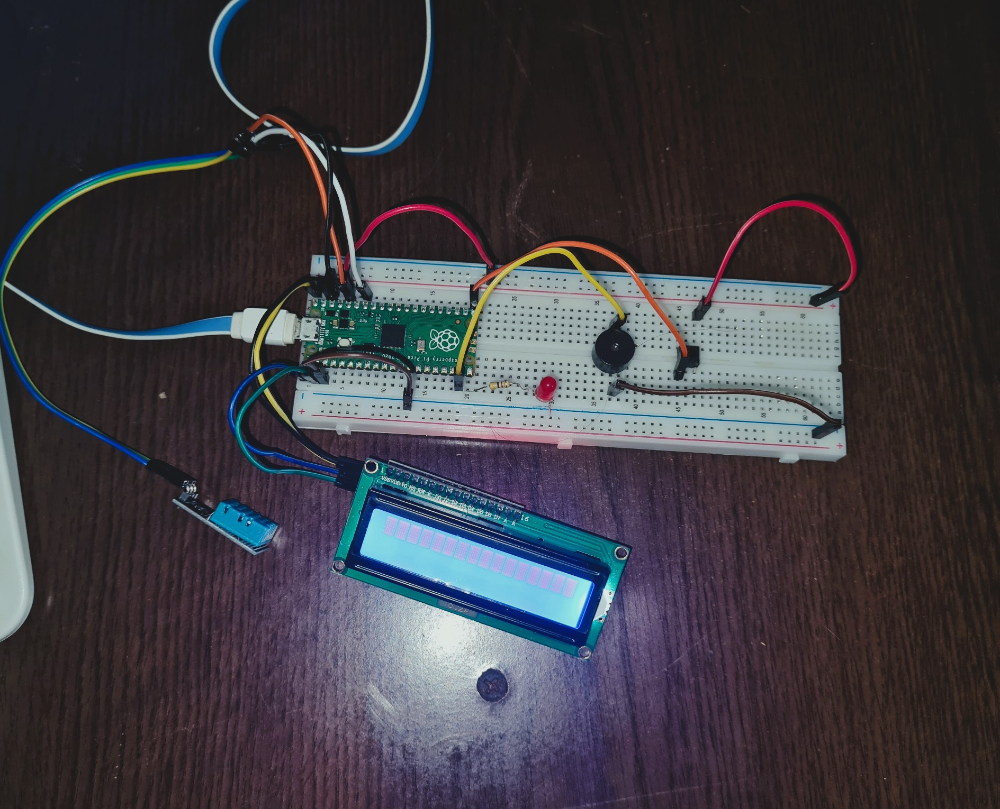

# TRABAJO FINAL INTEGRADOR
## Electronica - MicroPython -Raspberry Pi Pico
## Reyeros, Marcos Agustín

## -

# CONSIGNA:
La propuesta del TFI implica resolver un problema real, que consiste en la medición de dos variables físicas (en este caso temperatura y humedad relativa), la visualización de los valores correspondientes en un display, y la emisión de una señal de alerta a un valor determinado.

## ACTIVIDAD 1:
Como primera actividad, deben incorporar el display LCD1602 al circuito que realizaron en la Parte I, y visualizar allí los datos de temperatura y humedad relativa. Recuerden que disponen de 16 caracteres por renglón.

## Actividad 2:
Por último, a su pequeña estación meteorológica le incorporarán una señal de alarma, que se accione cuando ocurra una determinada condición. Para ello, al circuito de la Actividad N°1, deben sumarle una alarma lumínica (LED) o sonora (Zumbador), queda a elección de ustedes cual implementar.

La condición a cumplir es que se accione cuando la humedad relativa sea superior al 70%.

# DESARROLO 
Para el trabajo final fui avanzando de distintas maneras en el video se muestra el final pero tuve 3 versiones del proyecto.

## Version 1:
El display muestra la temperatura y humedad, y al llegar a 30°C o mas la temperatura se prende un led rojo avisando esto y al llegar al 70% de humedad se prende un led verde avisandonos lo ocurrido (*Las pruebas de la humdedad se hicieron para el valor de 40% para verificar que el led se prendia*).

```python
from machine import Pin, I2C
from utime import sleep
from lcd_api import LcdApi
from pico_i2c_lcd import I2cLcd
from dht import DHT11

dht11_sensor = DHT11(Pin(28, Pin.IN))
dht11_sensor.measure()
temp = dht11_sensor.temperature()
hum = dht11_sensor.humidity()

LED_externo = Pin(15, Pin.OUT)
LED_externo2 = Pin(14, Pin.OUT)

scl = Pin(1)
sda = Pin(0)
freq = 400000

i2c = I2C(0,sda=sda,scl=scl,freq=freq)

I2C_ADDR = 0x27
I2C_NUM_ROWS = 2
I2C_NUM_COLS = 16

lcd = I2cLcd(i2c, I2C_ADDR, I2C_NUM_ROWS, I2C_NUM_COLS)
while True:
    sleep(2)
    lcd.clear() # Borra cualquier caracter previo que exista
    lcd.move_to(0,0) # Posiciona el cursor en el primer renglón y en la primera columna
    
    dht11_sensor.measure()
    temp = dht11_sensor.temperature()
    hum = dht11_sensor.humidity()
    
    if temp >= 30:
        LED_externo.value(1)
    else:
        LED_externo.value(0)
        
    if hum >= 40:
        LED_externo2.value(1)
    else:
        LED_externo2.value(0)
        
    
    Text = 'Temperatura:' + str(temp)  +chr(223)+"C" + 'Humedad:' + str(hum) + "%"
    lcd.putstr(Text) # Escribir en la pantalla
    sleep(5)

```

### Imagenes - Leds Apagados:



### Imagenes - Leds Encendidos:




### Imagenes - Circuito:


### LINK AL VIDEO DE MUESTRA:

[VIDEO DEL CIRCUITO](https://drive.google.com/file/d/1Ir5LIcTcuGxmtnPGJ_FUVRrV1kC39DEB/view?usp=share_link "estacion meterorologica v1")

---
## Version 2:
El display muestra la temperatura y humedad, y al llegar a 30°C o mas la temperatura se prende un led rojo avisando esto y al llegar al 70% de humedad empieza a sonar un buzzer avisandonos lo ocurrido el cual al apretar un pulsador lo detiene por 10 segundos aunque lo ideal seria a mi criterio por 30 minutos (*en el video para mostrar su funcionamiento se lo hace con un timer de 10 segundos, pero en caso de hacerlo por 30min llevaria un timer de 1800seg o 1800000 mseg aunque se tendrian que usar timers anidados*),
pero para no olvidarnos que seguimos en esos valores el display nos muestra un mensaje por 3seg auque no suene la alarma.

```python
from machine import Pin, I2C
from utime import sleep
from lcd_api import LcdApi
from pico_i2c_lcd import I2cLcd
from dht import DHT11
import _thread

dht11_sensor = DHT11(Pin(28, Pin.IN))
dht11_sensor.measure()
temp = dht11_sensor.temperature()
hum = dht11_sensor.humidity()

LED_externo = Pin(15, Pin.OUT)
Buzz = Pin(14, Pin.OUT)
tim = machine.Timer()

pulsador = Pin(16, Pin.IN, Pin.PULL_DOWN)

scl = Pin(1)
sda = Pin(0)
freq = 400000

i2c = I2C(0,sda=sda,scl=scl,freq=freq)

I2C_ADDR = 0x27
I2C_NUM_ROWS = 2
I2C_NUM_COLS = 16

lcd = I2cLcd(i2c, I2C_ADDR, I2C_NUM_ROWS, I2C_NUM_COLS)

a=1

def offBuzz(pin):
    global a
    a = 0
    Buzz.value(0)

pulsador.irq(offBuzz, machine.Pin.IRQ_RISING)
    
def tick(timer):
    global a
    a = 1
       
while True:
    sleep(2)
    lcd.clear() 
    lcd.move_to(0,0) 
    
    dht11_sensor.measure()
    temp = dht11_sensor.temperature()
    hum = dht11_sensor.humidity()
    
    Text = 'Temperatura:' + str(temp)  +chr(223)+"C" + 'Humedad:' + str(hum) + "%"
    lcd.putstr(Text) 
    sleep(5)
    
    if temp >= 30:
        LED_externo.value(1)
        lcd.clear()
        lcd.move_to(0,0)
        lcd.putstr("Cuidado: ALTA   TEMPERATURA")
        sleep(3)
        lcd.clear()
    else:
        LED_externo.value(0)
        
    if hum >= 70:
        if a == 0 :
            tim.init(period=10000, mode=machine.Timer.PERIODIC, callback=tick)
        Buzz.value(a)
        lcd.clear()
        lcd.move_to(0,0)
        lcd.putstr("Cuidado: HUMEDAD RELATIVA > 70% ")
        sleep(3)
    else:
        Buzz.value(0)
        

```

### Imagenes - Circuito:



### Imagenes - Aviso temperatura y humedad:


### LINK AL VIDEO DE MUESTRA DE Version-2:

[VIDEO DEL CIRCUITO-v2](https://drive.google.com/file/d/1J3EBnQV_WdYTRgEacSEGX4CIRgN4vGkW/view?usp=share_link "estacion meterorologica v2")

---
## Version-3-(VersionFnial):
El display muestra la temperatura y humedad, y al llegar a 30°C o mas la temperatura se prende un led rojo avisando esto y al llegar al 70% de humedad empieza a sonar un buzzer avisandonos lo ocurrido el cual al apretar un pulsador lo detiene por 10 segundos aunque lo ideal seria a mi criterio por 30 minutos (*en el video para mostrar su funcionamiento se lo hace con un timer de 10 segundos, pero en caso de hacerlo por 30min llevaria un timer de 1800seg o 1800000 mseg aunque se tendrian que usar timers anidados*),
pero para no olvidarnos que seguimos en esos valores el display nos muestra un mensaje por 3seg auque no suene la alarma.

### Actualización de V2:
    "Se agrego un display olded con su resptectiva libreria guardada en la memoria de la raspberry pí pico que nos muestra un mensaje que no hay nadie cerca y si alguien se acerca, atravez de un sensor PIR cambia el mensaje por un logo de MircroPython.
    Para esto se hizo uso de la segunda linea del procesador para que realize esta tarea en segundo plano atravez de una funcion ("estadoOled()") junto con la librebria "_thread". Tambien se definio una función llamada ("open_pbm()") que lo que nos hace es cargar un logo  en formato PBM-"Portable Bit Map" que previamente se guardo en la memoria de la raspberry pi pico en una carpeta llamada images"

### Imagen de las nuevas librerias y la carpeta dentro de la Raspberry pi pico


### Imagen del logo guardado


### CODIGO VERSION FINAL

```python
from machine import Pin, I2C
from utime import sleep
from lcd_api import LcdApi
from pico_i2c_lcd import I2cLcd
from dht import DHT11
import _thread
import machine
from ssd1306 import SSD1306_I2C
import framebuf


dht11_sensor = DHT11(Pin(28, Pin.IN))
dht11_sensor.measure()
temp = dht11_sensor.temperature()
hum = dht11_sensor.humidity()

LED_externo = Pin(15, Pin.OUT)
Buzz = Pin(14, Pin.OUT)
tim = machine.Timer()

pulsador = Pin(16, Pin.IN, Pin.PULL_DOWN)

scl = Pin(1)
sda = Pin(0)
freq = 400000

i2c = I2C(0,sda=sda,scl=scl,freq=freq)

I2C_ADDR = 0x27
I2C_NUM_ROWS = 2
I2C_NUM_COLS = 16

lcd = I2cLcd(i2c, I2C_ADDR, I2C_NUM_ROWS, I2C_NUM_COLS)

#Congigiracion-SensorPir

sensor_pir = Pin(21, Pin.IN, Pin.PULL_DOWN)

#OLED-Configuración

i2c2 = I2C(1,sda=Pin(26), scl=Pin(27))
oled = SSD1306_I2C(128, 64, i2c2)

#Defino-funcionParaAbrirImagen-PBM("LOGO")

def open_pbm(ruta_i):
    doc = open(ruta_i,"rb")
    doc.readline()
    posXY = doc.readline()
    x = int(posXY.split()[0])
    y = int(posXY.split()[1])
    logo = bytearray(doc.read())
    doc.close()
    return framebuf.FrameBuffer(logo , x, y, framebuf.MONO_HLSB)

a=1
b=0

#INTERRUPCION_PARA_EL_BUZZER: Lo apaga
def offBuzz(pin):
    global a
    a = 0
    Buzz.value(0)
           
pulsador.irq(offBuzz, machine.Pin.IRQ_RISING)


#FUNCION_QUE_ACTIVA_EL_BUZZER_DESPUES_DEL_TIMER
def tick(timer):
    global a
    a = 1
    
#Se usa el segundo hilo para que el display OLED cambie de mensaje     
def estadoOled():
    while True:
        if sensor_pir.value() == 1:
            oled.fill(0)
            oled.blit(open_pbm("images/micropython-1.pbm"), 35, 5)
            oled.show()
            sleep(10)
        else:
            oled.fill(0)
            oled.text('NO HAY NADIE', 15, 30)
            oled.text('CERCA', 40, 40)
            oled.show()
        
_thread.start_new_thread(estadoOled, ())
    
       
while True:
    sleep(2)
        
    lcd.clear() 
    lcd.move_to(0,0) 
    
    dht11_sensor.measure()
    temp = dht11_sensor.temperature()
    hum = dht11_sensor.humidity()
    
    Text = 'Temperatura:' + str(temp)  +chr(223)+"C" + 'Humedad:' + str(hum) + "%"
    lcd.putstr(Text) 
    sleep(5)
    
    if temp >= 30:
        LED_externo.value(1)
        lcd.clear()
        lcd.move_to(0,0)
        lcd.putstr("Cuidado: ALTA   TEMPERATURA")
        sleep(3)
        lcd.clear()
    else:
        LED_externo.value(0)
        
    if hum >= 70:
        if a == 0 :
            tim.init(period=10000, mode=machine.Timer.PERIODIC, callback=tick)
        Buzz.value(a)
        lcd.clear()
        lcd.move_to(0,0)
        lcd.putstr("Cuidado: HUMEDAD RELATIVA > 70% ")
        sleep(3)
    else:
        Buzz.value(0)
```

### IMAGENES DEL PROYECTO


### SUGERENCIAS:
    "Las librerias nuevas usadas se encuentran en la carpeta (CodigoVersiones/archivosEXTRA), tambien le sugiero leerlo desde VisualStudioCode para ver mejor las imagenes, creo que hay un gift que desde github no se ve.
    Acontinuacion el link al video del funcionamiento completo"

### Conceptos Utilizados:
    * Entradas y Salidas Digitales
    * Como prender un LED/Buzzer Activo
    * Resistencias PULL DOWN
    * Sensores (PIR / TEMPERATURA Y HUMEDAD)
    * Display LCD/OLED
    * Interrupciones
    * Manejo de las 2 lineas del procesador
    * Timer


### LINK AL VIDEO DE MUESTRA DE Version-3(FINAL):

[VIDEO DEL CIRCUITO-v3](https://drive.google.com/file/d/1MkuThODbKXA7pwQ2b41SdQ8YZVdyp7Aq/view?usp=share_link "estacion meterorologica v3")